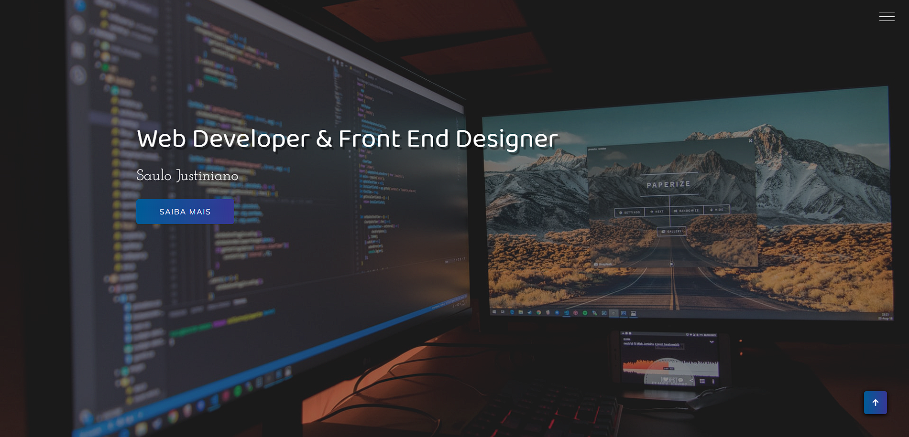

<h1 align="center">
  Portifólio Web
</h1>

  
  
  
  
  

  
  
  

  

## ⚙️Projeto

Esse projeto foi desenvolvido durante uma video aula do [**João Carlos**](https://www.youtube.com/channel/UCStdvHzCL5n76P7WJqGBGzA). Playlist completa [aqui](https://www.youtube.com/playlist?list=PLM_90--7SomWgfPYCXnpuoY2L-Z_Z-AiV).

**🚀Tecnologias:**

- [HTML5](https://developer.mozilla.org/pt-BR/docs/Web/HTML)
- [CSS3](https://developer.mozilla.org/pt-BR/docs/Web/CSS)
- [Git](https://git-scm.com)
- [Visual Studio Code](https://code.visualstudio.com)

**💡Commit:**

- 📦 Create - _Funcionalidades novas_
- 📤 Update - _Atualizações de códigos_
- 🐞 Bug - _Correções de Bugs_
- 🚩 Realese - _Versões do projeto_
